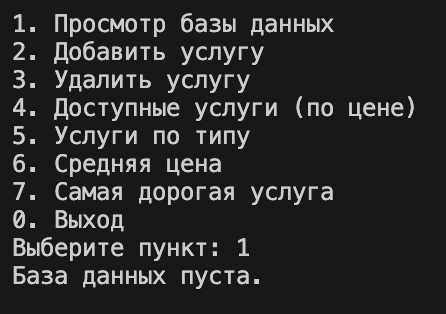
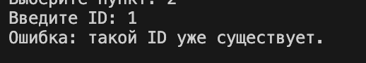
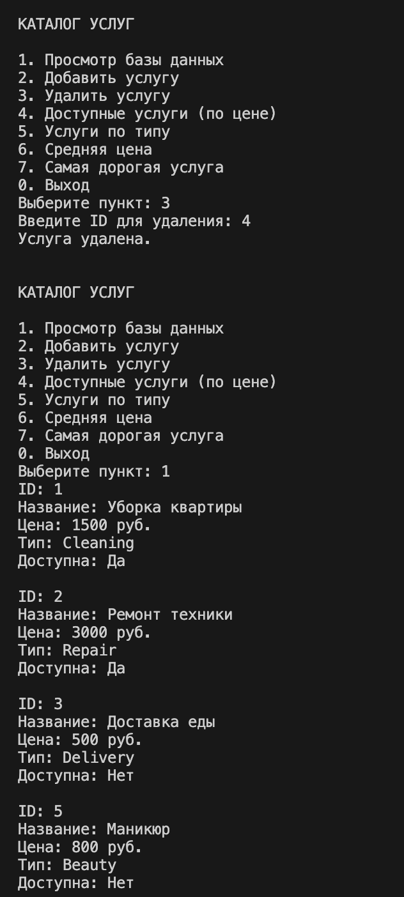
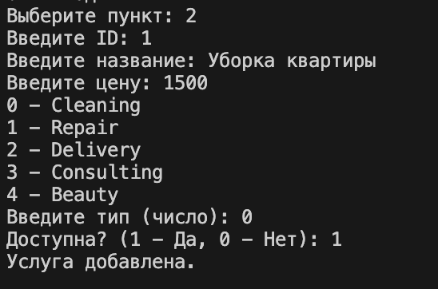
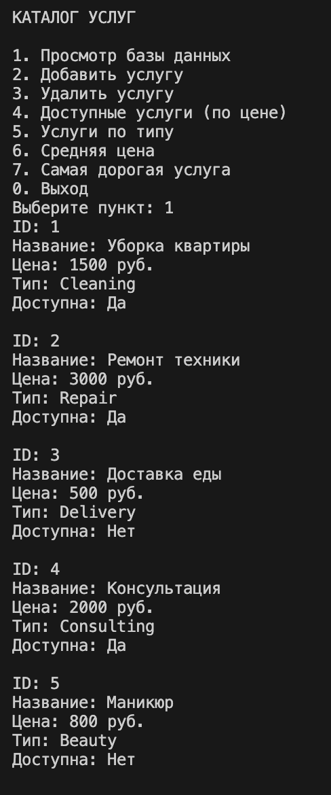
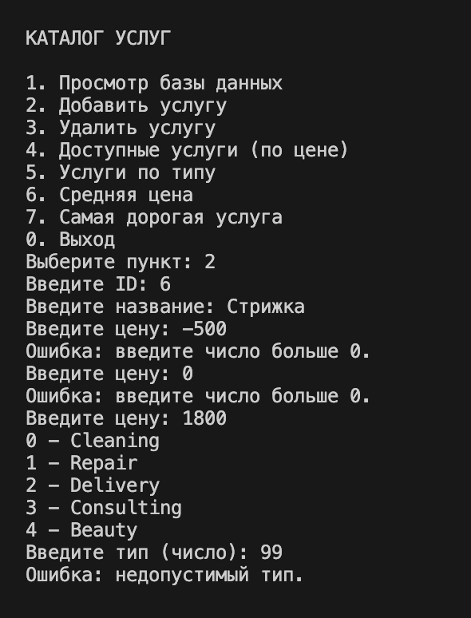
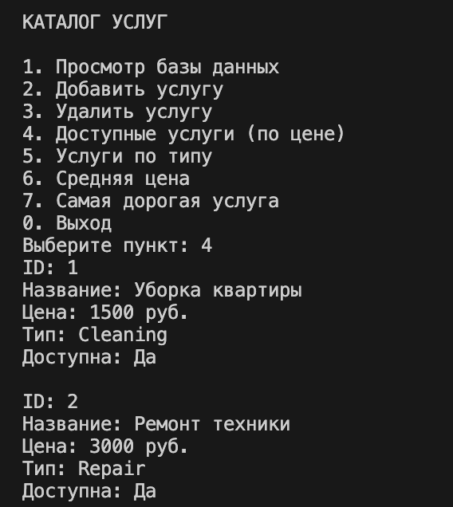
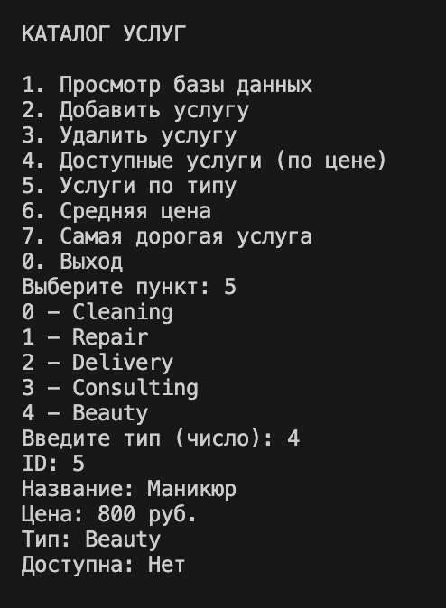
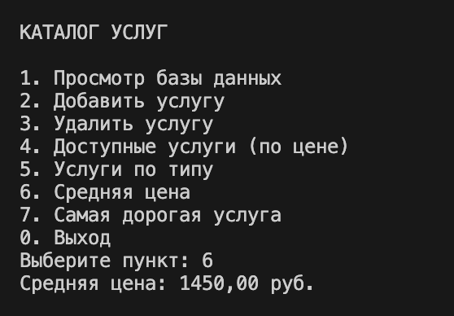
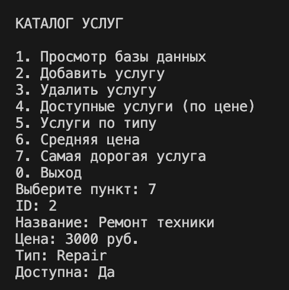

# Фадеев Михаил БАС-1-24 Лабораторная №8

# Задание 1

## Задача 7

### Текст задачи

Разработать консольное приложение с дружественным интерфейсом с возможностью выбора заданий для работы с «базой данных (БД)», хранящейся в бинарном файле. Перечень полей (минимум 5), достаточно полно характеризующих заданную в варианте предметную область, предложить самостоятельно (постараться отразить в перечне полей такие, которые требуют разных типов данных). Приложение должно выполнять следующие функции:
1. Чтение базы данных из бинарного файла.
2. Просмотр базы данных.
3. Удаление элементов (по ключу).
4. Добавление элементов.
5. Реализация 4 запросов (формулировки запросов придумать самостоятельно). 2 запроса должны возвращать перечень, 2 запроса одно значение.

В классе должны присутствовать свойства, конструкторы, перегруженный метод ToString(). Весь функционал приложения реализовать в виде методов вспомогательного класса с помощью LINQ-запросов. Предусмотреть обработку возможных ошибок при работе программы.

### Алгоритм решения

Предметная область: **Каталог услуг**

Класс `Service` содержит 5 полей разных типов:

| Поле | Тип | Описание |
|---|---|---|
| `Id` | `int` | Уникальный идентификатор |
| `Name` | `string` | Название услуги |
| `Price` | `double` | Стоимость в рублях |
| `Type` | `ServiceType` | Тип услуги (перечисление) |
| `Available` | `bool` | Доступность услуги |

Перечисление `ServiceType`: `Cleaning`, `Repair`, `Delivery`, `Consulting`, `Beauty`.

Данные хранятся в бинарном файле `DB.bin`. Сериализация реализована через `BinaryWriter` / `BinaryReader`. При сохранении первым записывается количество элементов, затем поля каждого объекта в фиксированном порядке.

Весь функционал вынесен в класс `ServiceCatalog`. Реализованы следующие LINQ-запросы:

1. Доступные услуги, отсортированные по цене — `Where` + `OrderBy`
2. Услуги по заданному типу — `Where`
3. Средняя цена услуг — `Average`
4. Самая дорогая услуга — `OrderByDescending` + `FirstOrDefault`

Обработка ошибок реализована через:
- В классе `Service` через `ArgumentException`
- Проверку существования файла перед чтением через `File.Exists`
- `try-catch (IOException)` при чтении и записи файла
- Проверку уникальности ID при добавлении
- Валидацию типа услуги через `Enum.IsDefined`
- Защиту от некорректного ввода в `HelpConsole` через `TryParse` каждого типа данных

### Тестирование

